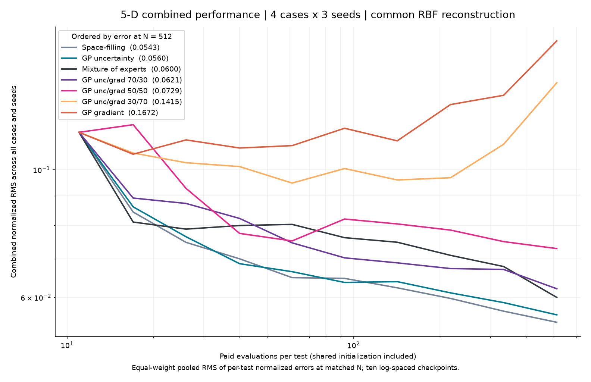

# UQ discontinuities: equal-point 2-D benchmark

Compare simulation-placement strategies by the RMS error of the same low-poly
reconstruction at **every integer number of paid evaluations**. Start with the
[plot guide](results/2d/README.md), [five-sheet report](results/2d/index.html)
or [results and interpretation](RESULTS.md).

The performance scorecard combines all four surfaces and three seeds into one
log-log error-versus-points chart for every method, with equal weight per test.
Per-case diagnostics remain available to explain differences hidden by pooling.

## Repository layout

Every study follows the same shape: a package holding the code, and one
`results/<dim>d/` directory holding what that code produced, with a
`PROVENANCE.md` naming the exact commands.

```
benchmark2d/     two-dimensional study: surfaces, policies, merge, report
benchmarknd/     five- and eight-dimensional study: cases, policies, collect, checks, tables
arms/            external sparse-grid adapters (sg_lib, SG++), shared by both
tools/           helper scripts that are not part of a study (run progress)
legacy/          superseded standalone oracle, kept for reference
tests/           one test module per package
results/
  2d/            results.json, aggregate-scores.json, index.html, figures/, source zips
  5d/            results.json, figures/
  8d/            figures/ (trajectories still running)
outputs/         raw per-run working directories, not tracked
```

Anything under `results/` is regenerated by the commands in that directory's
`PROVENANCE.md`; nothing there is edited by hand.

## Surfaces

All inputs are in the unit square. Cases are continuous, with Gaussian peaks
inside mode regions, away from mode switches:

| CLI case | Geometry | Total peaks |
|---|---|---:|
| `smooth` | Smooth baseline with one peak | 1 |
| `two-plane-four-peaks` | Two affine regions, two peaks in each | 4 |
| `three-plane-three-peaks` | Three affine regions, one peak in each | 3 |
| `two-plane-asymmetric` | Two affine regions, two peaks in one and one in the other | 3 |

Folded baselines are maxima of affine planes. Smooth additive bumps preserve
the baseline switches. Seed rotates the geometry; peak centers remain at least
0.15 normalized units from folds. These are synthetic growth-rate proxies, not
validated mode physics. The previous on-fold Gaussian and jump cases are removed.

## Run

Use Python 3.11 and the dependencies in `requirements-sgpp.txt` for the full field.
Real SG++ 3.3.1 requires the compatible Linux/NumPy 1.x environment described there.
Ionut's library is an external checkout selected by `SG_LIB_PATH`.

```bash
python3.11 -m venv .venv
.venv/bin/python -m pip install -r requirements-sgpp.txt
export SG_LIB_PATH=/path/to/sensitivity-driven-sparse-grid-approx
.venv/bin/python -m benchmark2d --quick --output outputs/quick
.venv/bin/python -m benchmark2d --seeds 0 1 2 --budgets 32 64 128 256 --native-test-size 1024 --output outputs/full
.venv/bin/python -m benchmark2d --plots-only --output results/2d
```

`--budgets` sets diagnostic checkpoints and the largest run length. It does **not**
launch independent runs at each cap: all N from 4 to the maximum are scored on
one nested trajectory. `--resume` requires identical code/configuration. Results
are saved atomically after each complete trajectory. Use a new output directory
to change the experiment; existing data are not silently overwritten.

For built-in methods on Windows, install `requirements.txt` and explicitly select
`--arms grid moe gpr-var gpr-grad triangles`. Windows runs of the built-in arms
reproduce the saved Linux trajectories exactly when the pinned library versions
are used. Unavailable backends are reported;
mocks never enter rankings.

## Three additional mixtures

Weights are fixed before running this extension, using the ranking in commit
`1da61c4` to choose MoE and triangles as components. These are acquisition-score
blends, not weighted predictions or extra independently paid runs:

| Arm | Normalized acquisition mixture |
|---|---|
| `gpr-blend` | 50% GP gradient merit + 50% GP uncertainty |
| `moe-tri75` | 75% original MoE acquisition + 25% triangle acquisition |
| `moe-tri50` | 50% original MoE acquisition + 50% triangle acquisition |

Each component score is divided by its candidate maximum before weighting.
All components share the same paid observations. The triangle policy contributes
scores at its centroid proposals; MoE also considers random candidates. Both
retain their every-fifth-step exploration rule before blending. GP blends use
one fitted GP and the same 1,024 candidates as the standalone GP policies.
Native predictions use the GP or existing MoE predictor respectively; this test
primarily ranks placement through the common low-poly reconstruction.

These choices are follow-up hypotheses on the existing benchmark, not held-out
confirmation or a guarantee of beating the components. No weights are retuned
using the new results. Run only the new arms with the original case/seed/budget
and scoring settings; retain original trajectory provenance when joining reports.

## GP uncertainty / GP gradient ratio sweep

Five fixed mixtures of the two standalone GP acquisition policies, declared in
`GP_BLENDS` before running. The first number is the GP-uncertainty share and the
second the share of the gradient-weighted merit used by `gpr-grad`:

| Arm | Normalized acquisition mixture |
|---|---|
| `gpr-u20-g80` | 20% GP uncertainty + 80% GP gradient merit |
| `gpr-u30-g70` | 30% GP uncertainty + 70% GP gradient merit |
| `gpr-u50-g50` | 50/50; identical policy to the existing `gpr-blend` |
| `gpr-u70-g30` | 70% GP uncertainty + 30% GP gradient merit |
| `gpr-u80-g20` | 80% GP uncertainty + 20% GP gradient merit |

Both components come from one fitted GP per step and the same 1,024 candidates
as the standalone GP policies, so a blend costs no extra evaluations. Each score
is divided by its own candidate maximum before weighting. The gradient component
keeps its exploration floor, so `gpr-u20-g80` is not a pure gradient rule. The
0% and 100% ends of the sweep are the existing `gpr-grad` and `gpr-var` arms and
are not rerun.

```bash
for arm in gpr-u20-g80 gpr-u30-g70 gpr-u50-g50 gpr-u70-g30 gpr-u80-g20; do
  python -m benchmark2d --arms $arm --seeds 0 1 2 --budgets 32 64 128 256     --native-test-size 1024 --output outputs/ratio-$arm
done
cp results/2d/results.json /tmp/pilot-base.json
python -m benchmark2d.merge --base /tmp/pilot-base.json   --add outputs/ratio-*/results.json --top 3 --output results/2d
```

The merge re-renders the pilot report in place, so copy the base payload aside
first: the three kept blends join the seven original methods in every sheet and
in the qualification table.

`benchmark2d.merge` joins saved trajectories only: it copies rows verbatim,
refuses runs that disagree on cases, seeds, budgets, test size or tolerances,
rejects duplicate arms or rows, and records one provenance entry per contributing
run. `--top 3` keeps the three added arms with the lowest combined normalized RMS
at the largest matched point count and drops the rest from the report. Sources as
executed are archived in `results/2d/ratio-experiment-sources.zip`. That
ranking reads the benchmark it is displayed on, so it is a presentation choice,
not held-out validation; the full five-arm ranking is saved under `selection` in
the merged `results.json`.

## 5-D and 8-D extension (`benchmarknd/`)

Folded manifolds in five and eight dimensions where each mode is deliberately
non-responsive in several axes, mimicking a mode that ignores whole coordinate
ranges. Four cases per dimension: one mode with one peak, two modes with an
axis-aligned fold, two modes with a dense fold, and two modes with disjoint
active subspaces and an extra peak. Strength patterns are declared per mode
(`S` strong, `M` moderate, `W` weak, `.` inert); 5-D modes ignore two to three
axes and 8-D modes five. An inert axis changes the value by exactly zero.

Three things forced changes to the 2-D setup:

| 2-D choice | Why it fails above two dimensions | Replacement |
|---|---|---|
| Delaunay reconstruction | at d=8, N=512 it costs 346 s and leaves 85% of the test set outside the convex hull | one fixed thin-plate-spline RBF for every arm |
| `triangles`, MoE's triangle and bilinear-grid experts | Delaunay again; a bilinear grid needs `side**d` coefficients | `triangles` dropped; MoE now gates k-NN linear, quadratic-ANOVA ridge and GP |
| `grid`, 2^d charged corners, 0.06 duplicate radius, 1,024 candidates | 256 corners at d=8; the radius excludes nothing when neighbours sit 0.4 apart | Sobol space-filling baseline, shared `2d+1` Latin-hypercube start, radius `0.1*N^(-1/d)`, `512*d` candidates |

Scoring happens at ten log-spaced checkpoints: at d=8 the scorer costs about
32 minutes per trajectory when every integer N is scored and 19 seconds at ten,
and the trajectory is identical either way.

```bash
python -m benchmarknd --cases 5d-m2-rotated --seeds 0 --output outputs/nd-run/5d-m2-rotated-s0
python -m benchmarknd.collect --run outputs/nd-run --dims 5 8 --output results
python -m benchmarknd.checks          # geometry and scorer validation
python tools/nd_progress.py --logs $TEMP/ndlogs --results outputs/nd-run --watch
python -m benchmarknd.tables      # strength tables into results/<dim>d/figures
```

`collect` refuses to write a dimension until every case, seed and arm finished,
so a partial run cannot be read as a complete one.

### 5-D result

**Adaptive placement loses to plain space-filling, and the gradient-weighted
acquisitions that won in 2-D are the worst performers here.** Combined
normalized RMS at N = 512, four cases and three seeds, common RBF scorer:

| Arm | Combined | m1-p1-anis | m2-aligned | m2-disjoint | m2-rotated |
|---|---:|---:|---:|---:|---:|
| Space-filling | 0.0543 | 0.0497 | 0.0544 | 0.0468 | 0.0622 |
| GP uncertainty | 0.0560 | 0.0513 | 0.0562 | 0.0483 | 0.0661 |
| Mixture of experts | 0.0600 | 0.0583 | 0.0595 | 0.0515 | 0.0699 |
| GP unc/grad 70/30 | 0.0621 | 0.0672 | 0.0584 | 0.0468 | 0.0711 |
| GP unc/grad 50/50 | 0.0729 | 0.0872 | 0.0673 | 0.0468 | 0.0809 |
| GP unc/grad 30/70 | 0.1415 | 0.2333 | 0.0818 | 0.0476 | 0.1037 |
| GP gradient | 0.1672 | 0.2887 | 0.1002 | 0.0567 | 0.1051 |

The gradient arms get **worse as the budget grows**. That is not a conditioning
failure: their RBF interpolation residual stays at 1e-13, the same as every
other arm. It is clustering. On `5d-m1-p1-anis` at N = 512 the minimum
neighbour distance is 0.035 for GP gradient and 0.305 for space-filling, so the
gradient rule spends its budget resolving one peak while the rest of the box
goes unsampled, and the global RMS pays for it. The ordering of the blend
ratios is monotone in the gradient share, which is consistent with that reading.

Two caveats belong with this result. The common RBF reconstructor is isotropic,
so a design that concentrates on the active axes gains nothing from doing so
(measured headroom over a space-filling design: 1.0x). An ARD-GP reconstructor
on the identical designs is 3-15x more accurate and recovers the planted length
scales, so the absolute error levels here are a property of the scorer as much
as of the samplers. Rankings under a second reconstructor are not yet measured.



## Contenders

| Arm | Placement rule |
|---|---|
| `grid` | Progressive dyadic regular grid, maximin ordering within each level |
| `sglib` | Ionut Farcas's sensitivity-driven subspace refinement |
| `sgpp` | Real SG++ modified-linear surplus refinement |
| `gpr-var` | Matern-3/2 GP posterior standard deviation |
| `gpr-grad` | GP uncertainty times predicted gradient, with an exploration floor |
| `triangles` | Triangle area / neighboring-gradient disagreement; area exploration every fifth step |
| `moe` | Locally gated triangle, bilinear-grid and GP experts, sharing one observation budget |

Sobol is removed as a contender. The independent scoring integration set still
uses a fixed scrambled Sobol design; it never enters acquisition.

GP, triangle and mixture policies share five Latin-hypercube initialization
points plus four charged corners. GP policies now acquire one point per fit.
The progressive grid replaces the previous full-square-at-each-cap design so
it can spend every budget exactly. The triangle policy is a proposed heuristic,
not a published high-order simplex stochastic collocation implementation.

### Mixture of experts

The prior pilot's shortlist, excluding Sobol, is frozen before the new experiment:
triangles, grid and GP uncertainty (commit `b4899ad`, old `RESULTS.md`). This is
selection from the prior pilot, not a claim of equal-N ranking in that old data.

All experts fit the **same paid samples**. The grid is a sampling policy, so its
predictive expert is a regular bilinear basis fitted by ridge regression to those
shared observations. Local weights learn squared prediction errors recorded
before each new observation is revealed. Acquisition blends triangle discrepancy,
space filling, GP uncertainty and expert disagreement, with periodic exploration.
No reference test values, peak centers or fold locations reach the mixture.

The primary score tests whether the mixture **places points better**. Optional
`native_error` at final N separately tests its mixed predictor and GP predictors
on the same held-out subset. It does not replace the common score.

## Fair comparison and score

- One unique point is one paid evaluation. Four common corners count for every
  method and guarantee the common triangulation covers the square. Duplicate
  requests are cached. An incomplete trajectory fails rather than padding points.
- Native sparse grids still choose refinement batches. Their prescribed nodes
  are paid in order; a trajectory can finish partway through a batch. Every prefix
  is scored by the common reconstructor, even when a native grid update is not yet
  complete. Zero-tolerance sg_lib and negative stopping-threshold SG++ continuation
  disable convergence-based early exit. sg_lib caps each direction at level 20
  and continues other admissible subspaces, retaining its refinement priorities;
  reaching one axis limit no longer stops the whole fixed-budget experiment.
  Native sparse-grid predictions are omitted for these truncated grid states.
- Truth and geometry are evaluator-only. A fixed independent set of 16,384 points
  scores piecewise-linear Delaunay reconstruction. RMS is normalized by one fixed
  truth range per case/seed, shared by all methods and regions.
- Global, fold-band (distance < 0.06) and peak-region errors are saved at every N.
  Smooth has no fold: its band metric repeats global RMS. Exact common RBF scores
  are secondary cross-checks at the requested diagnostic checkpoints only.
- Curves use log-log axes and show medians/IQR over paired seeds. Every point on
  every curve is an equal-N comparison. Placement and residual sheets show the
  same final N and representative seed for all methods.
- Qualification requires normalized global RMS <= 0.05 and fold-band RMS <= 0.10,
  sustained at **every subsequent integer N through the tested maximum**. Report
  per-case qualifying costs and fixed-N errors; unreached targets remain unreached.
  Qualification is finite-horizon evidence, not guaranteed future monotonicity.
- The final row stores coordinates and observed values once. Earlier designs are
  prefixes of those arrays. Scoring replays cached values without new oracle calls.

## Tests and code

```bash
python -m pytest tests/test_benchmark2d.py -q
python -m pytest tests/test_exact_sparse.py tests/test_sgpp_real.py -q
python -m pytest tests/test_sgpp_arm_mock.py -q
```

Run mocks separately because they replace the compiled backend at import time.
`benchmark2d/core.py` defines geometry/scoring; `strategies.py` sampling;
`mixture.py` shared-budget experts and gates; `report.py` the five comparison
sheets; `__main__.py` trajectories, provenance and resume. Existing `arms/`
adapters remain. Earlier experiments and removed scripts are retained in Git.

Next, confirm the strongest designs on held-out geometries and peak widths,
then add failed/retried evaluations and real GENE node-hour costs before selecting
a production runner.

The saved pilot records both execution source hashes for reused trajectories and
rerun sg_lib trajectories. Exact source archives accompany the results; renderer
provenance is recorded separately. No new observations were generated when
merging the independently executed methods into the final comparison.
